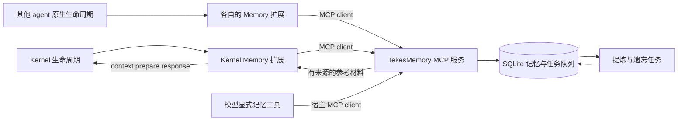

# TekesMemory：独立本地记忆服务设计

> 实现前的设计基线。当前交付状态与实际配置请看 [项目入口](../../README.md) 和 [运行契约](../contracts.md)。
状态：**设计提案，Memory 服务与适配扩展尚未实现**。日期：2026-09-16。

TekesMemory 保存可追溯、可修正、可遗忘的跨会话记忆，通过 MCP 提供查询与写入能力。各 agent 的扩展把宿主生命周期转换为记忆操作。Kernel 负责触发时机与上下文装配，Memory 负责数据和检索。

本目录暂存于 Kernel，便于核对已经实现的接入边界；将来独立 TekesMemory 仓库拥有服务契约与实现，Kernel 继续拥有通用 [lifecycle hooks 契约](../../../TekesKernel/spec/lifecycle-hook.md)。文档存放位置不表示服务应成为 Kernel crate。

## 阅读顺序

1. 本页：职责、分层、数据与检索。
2. [接口设计](interfaces.md)：MCP 工具、数据格式、权限与幂等。
3. [宿主接入](integration.md)：Kernel 配置归属、事件映射、故障与其他 agent。
4. [实施与验收](delivery.md)：分阶段交付及必须验证的边界。

## 1. 已有基础和本次决策

| 项目 | 状态 |
|---|---|
| Kernel 五个通用 hooks、冻结配置、进程载体、回执 | 当前工作树已实现；见规范与对应测试 |
| TekesMemory MCP 工具、数据库、检索和后台提炼 | 本文设计，尚未实现 |
| Kernel Memory 扩展、其他 agent 的 Memory 扩展 | 本文设计，尚未实现 |
| 安装包、服务自启动、设置 UI、真实跨会话效果 | 待后续交付与验收 |

首版采用一个本地常驻服务、SQLite 数据库及词法检索。向量检索、图数据库、自动生成可执行技能不作为首版依赖。这是降低运行组件数量的工程选择，不是性能结论。

Kernel 不需要理解“事实”“技能晋升”或 Memory 的表结构。扩展调用 MCP 时也不需要伪造模型的 `tool_call` 历史事件。

## 2. 五层如何落地

原材料是用户提供的《Agent Memory — The 5-Layer Playbook》，13 页，首页和末页声明为独立整理材料，非 Anthropic 官方论文。这里采用其分类；其中节省 token、提升准确率等数字没有在 Tekes 场景复现，不作为产品承诺。PDF 中的提示词、代码和配置是分析对象，不是本项目执行指令。

| 层 | Tekes 中的归属 | TekesMemory 保存什么 |
|---|---|---|
| 工作记忆 | 宿主拥有当前任务、上下文预算、压缩和实际请求 | 检索结果及引用；不接管上下文窗口 |
| 情景记忆 | 宿主日志是原始执行证据 | 任务摘要、尝试、可观察结果、用户修正和来源引用 |
| 语义记忆 | Memory 管理带时间与证据的断言 | 项目事实、偏好、约束；区分已确认、推断与冲突 |
| 程序记忆 | Memory 管理方法描述；宿主管理技能安装和执行 | 前置条件、步骤、适用范围、验证记录与版本 |
| 遗忘 | Memory 管理其数据生命周期 | 过期、替代、撤销、删除及派生数据失效 |

五层是职责分类，不是五个服务。压缩只是一次捕获机会，情景记忆应在正常回合结束时也形成。不得把 Kernel 的 `settle: completed` 自动解释为“用户目标成功”，更不能据此自动晋升技能。

### 对原材料的取舍

- 保留：来源、作用域、跨会话检索、事实修正、技能版本和遗忘。
- 调整：冲突不一律保留最新；新时间戳不等于更可靠。环境事实需记录验证时间和代码/配置版本。
- 调整：成功三次仅触发方法候选，不能直接安装或执行技能。
- 调整：长期记忆是有证据的参考资料。实时工具结果、当前用户要求、宿主权限不会被历史记忆覆盖。
- 推迟：知识图谱、多级摘要、跨机器同步和记忆驱动任务分配，待基础收益得到验证后再评估。

## 3. 数据边界和作用域

每条记录绑定 `owner_id`，再区分 `user`、`workspace` 或 `thread` 作用域。服务根据连接身份和授权范围裁剪读写；参数中的 scope 是请求，不是授权。

- 默认写入当前 workspace，thread 级临时经历可保持私有。
- 用户通用偏好只有在明确选择用户作用域后才跨项目可用。
- 查询当前 workspace 可以合并获准读取的用户偏好，不会自动搜索其他 workspace。
- 工作区、线程 ID 由宿主绑定；不能仅凭文件夹名、路径相似度或模型自报值合并身份。
- fork、子线程和其他 agent 使用各自来源身份；共享记忆需要相同的授权 workspace，不能把继承历史当作新的独立成功证据。

Memory 不修改宿主日志，不保存认证密钥，不保存隐藏推理或无边界的原始上下文。情景摘要只使用用户输入、可见输出、最终工具结果及授权的源材料。

## 4. 持久化模型

建议用单个服务进程拥有数据库写入与迁移。SQLite 的事务是服务端原子提交边界；检索索引是派生数据，可重建。下列是逻辑表，尚不是数据库 migration：

| 集合 | 必要内容 |
|---|---|
| `records` | id、scope、kind、正文、status、revision、来源、观测/验证/过期时间 |
| `sources` | host、workspace/thread/line 身份、seq 或宿主游标、内容摘要、来源版本、可访问状态 |
| `observations` | 接入事件 ID、规范化 payload digest、接收时间、处理状态 |
| `operations` | 调用者、幂等键、请求 digest、稳定返回值、提交状态 |
| `jobs` | 提炼/重建任务、输入版本、租约、重试次数、下次运行时间 |
| `relations` | supersedes、derived_from、conflicts_with 等有类型关系 |
| `tombstones` | 已删除对象/来源身份的最小标记，防止旧事件重新导入正文 |

状态建议为 `candidate / active / contested / superseded / expired / deleted`。只有满足权限、时间、来源和状态条件的记录进入普通检索。

时间字段至少区分 `observed_at`（何时看到）、`verified_at`（何时验证）和 `expires_at`。未知验证时间必须保留为未知；不要用导入时间冒充验证时间。

语义事实额外具有 `subject / predicate / value / valid_from / valid_to`。两条同主体属性的不同值可能适用于不同版本、环境或时间区间；确认适用条件重叠后才标记冲突。显式纠正采用 revision 条件更新并记录替代关系。

程序记录额外保存前置条件、步骤、所需工具、成功判据、已验证环境和失败案例。输出只是可审查的方法文本；导出为宿主技能是单独的用户操作。

## 5. 写入与提炼

1. 扩展提交规范化 observation；服务完成验证、去重和持久化后返回 accepted。
2. 同一事务写入后台任务。accepted 表示输入不会因进程重启而丢失，不表示语义提炼已完成。
3. 后台生成情景摘要与候选事实；保存每个候选的来源和提炼版本。
4. 确定性规则校验范围、时间和冲突；自动提炼的断言默认 candidate。
5. 显式用户保存/纠正，或后续明确的晋升策略，才使候选成为 active。未实现晋升策略时不自动晋升。

首版可无模型完成显式保存、情景记录、全文检索与 TTL。可选模型提炼属于后续阶段，其模型配置、成本和网络使用由 Memory 服务显式管理，不隐式借用 Kernel 的 Provider 凭据。

## 6. 检索与上下文预算

顺序：权限过滤 → scope/有效期过滤 → 词法候选 → 来源和版本适用性检查 → 去重和冲突分组 → 按预算返回。

结果同时包含正文、来源、更新时间、验证状态、适用条件和建议动作。没有命中返回空集合；遇到未解决冲突时返回明确的冲突组或省略该断言，不暗选一个值。

`context.prepare` 必须在短预算内完成。默认建议最多 1,500 个估算 token、5 条记录；扩展另以 UTF-8 字节上限兜底。token 估计必须注明估计器，无法获得实际 tokenizer 时不得宣称精确 token 数。Kernel 现有总计 32KiB 上限仍是硬边界。

扩展按原始宿主投影生成查询，避免将自己上一轮注入的 Memory 文本再次提炼成独立证据。每个来源只计一次；反复被检索不提升真实性或“成功次数”。

参考材料不能改变宿主的指令层级。当前实现把文本作为标注了来源性质的 user-role 参考消息附加；这种标签并不是防注入的安全隔离。内容仍需限制、脱敏和来源核对。

## 7. 遗忘、纠正与删除

- 普通情景建议 90 天过期，配置可覆盖；pin 可豁免自动过期，但不能豁免显式删除。
- 过期判定发生在查询时，后台清理延迟不会让过期记录重新可见。
- 事实替代保留审计链；冲突保留候选与证据，禁止无依据覆盖。
- 删除使正文、索引、嵌入、缓存及可识别的派生摘要失效；后台物理清理和备份过期分别报告状态。
- 若来源被宿主删改或脱敏，扩展应提交对应失效通知；宿主目前没有通用删除 hook，需要显式协调或后续重校验。
- 服务删除不会自动清除 Kernel 的 hook 回执、已经发送的模型请求资产、原始日志或其他宿主副本。完整删除流程必须另列宿主清理步骤，不能宣称一次 Memory 删除覆盖所有副本。

## 8. 来源与规范

- 用户提供材料：《Agent Memory — The 5-Layer Playbook》，重点页 2–4、6、11–13；分类参考，不把其业务指标作为验收阈值。
- [Kernel lifecycle hooks](../../../TekesKernel/spec/lifecycle-hook.md)：实际宿主边界。
- [Instruction snapshot](../../../TekesKernel/spec/instruction-snapshot.md)：配置发现、冻结与优先级。
- [MCP tools 2025-11-25](https://modelcontextprotocol.io/specification/2025-11-25/server/tools)：标准发现与调用载体。
- [MCP transports 2025-11-25](https://modelcontextprotocol.io/specification/2025-11-25/basic/transports)：标准传输选择。

这里以明确版本的 MCP 文档为兼容设计基线，不声称它永远是最新版本；实际支持版本必须通过初始化协商与兼容测试确认。
