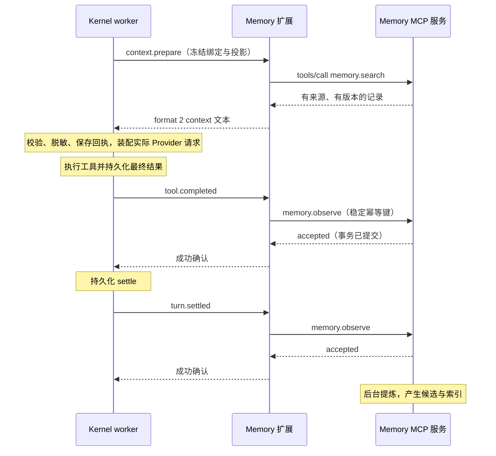

# TekesMemory 宿主接入与配置归属

> 实现前的设计基线。当前交付状态与实际配置请看 [项目入口](../../README.md) 和 [运行契约](../contracts.md)。
[总览](README.md) · [接口](interfaces.md) · [实施验收](delivery.md)

状态：Memory 扩展为提案；Kernel hooks 的行为以 [已实现契约](../../../TekesKernel/spec/lifecycle-hook.md) 为准。

## 1. 谁管理什么

| 信息或动作 | 所属方 |
|---|---|
| hook 名称、触发点、顺序、超时和返回权限 | Kernel |
| hook 订阅文件、启用状态、argv、显式 env | Kernel 侧配置，由用户/安装流程写入 |
| 哪个 hook 转成哪个 Memory 操作、来源格式转换 | Kernel Memory 扩展 |
| 服务引用、检索预算和扩展凭据引用 | 扩展配置，由 Kernel hook 引用 |
| MCP endpoint、数据库目录、保留策略、后台提炼配置 | Memory 服务配置 |
| 服务安装、自启动、升级和卸载 | 产品安装/服务管理组件；不是每轮 Kernel hook |
| 数据、授权 scope、幂等、冲突和遗忘 | Memory 服务 |

因此，前面讨论的启用与订阅信息在 **Kernel 一侧生效**，但 Memory 的业务配置不应硬编码进 Kernel。扩展包可以随附默认绑定模板；现有安装 receipt 不会自动激活 hook，必须通过受支持的配置发现路径安装并捕获。

## 2. Kernel 接入映射

| Kernel hook | 扩展行为 | 等待边界 |
|---|---|---|
| `turn.before` | 可选提交 turn_opened；不重复做 context.prepare 检索 | 等服务持久接受即可 |
| `context.prepare` | 生成查询，调用 memory.search，裁剪并标注参考文本 | 等有界查询完成；失败不注入 |
| `tool.completed` | 提交最终 post-policy 工具结果的 observation | 等服务持久接受，不等提炼 |
| `context.before_compact` | 保存 covers/through_seq 对应的上下文检查点 | 等持久接受；不阻止 Kernel 压缩 |
| `turn.settled` | 提交已持久化 outcome 和公开证据，触发情景提炼 | 等持久接受，不等提炼 |

首版最小接入可启用 context.prepare 与 turn.settled；完整接入再覆盖工具结果和压缩捕获。turn.before 是可选的任务打开标记，不应成为重复写入全量历史的入口。

只有 context.prepare 可以返回非空 context。其余 hook 只能确认，不能重写工具结果、拒绝任务、覆盖系统规则或重新打开回合。

压缩前 hook 可能发生在宿主摘要模型请求之后，它保证的是 compact 记录尚未写入。当前 hook 不保证所有崩溃场景都有捕获机会，也不保证 Memory 故障时先保存成功才压缩。

## 3. 配置示例

生产配置位置遵循 [Instruction snapshot](../../../TekesKernel/spec/instruction-snapshot.md)：用户级 `~/.agents/hooks/`，workspace 级 `~/.agents/workspaces/<workspace-id>/hooks/`，项目级 `<cwd>/.agents/hooks/`。

例如项目文件 `.agents/hooks/tekes-memory-context.json` 可采用下列 **Kernel 真实 format 2 结构**。路径和扩展命令为部署占位示例，扩展尚不存在，不可直接执行：

```json
{"argv":["/absolute/path/to/tekes-memory-kernel","--config","/absolute/path/to/immutable-adapter-config.json"],"enabled":true,"env":{},"event":"context.prepare","format":2,"id":"tekes-memory-context.json","stderr_bytes":4096,"stdout_bytes":65536,"timeout_ms":500}
```

文件必须为 RFC-8785 canonical JSON 加一个 LF；id 等于 hooks 下相对路径。每个事件单独一个绑定文件。用户/工作区/项目的覆盖规则和排序复用 Kernel，不新增 `extensions:` YAML 作为现有配置。

下面两个 JSON 则是 **待实现的扩展/服务配置示意**，字段不属于 Kernel：

扩展配置：

```json
{
  "schema_version": 1,
  "service_ref": "local-memory",
  "credential_ref": "tekes-memory-kernel",
  "retrieval": {"max_items":5,"estimated_tokens":1500,"max_utf8_bytes":12000},
  "request_timeout_ms": 350
}
```

服务配置：

```json
{
  "schema_version": 1,
  "listen": "127.0.0.1:PORT",
  "data_directory": "/absolute/path/to/tekesmemory-data",
  "retention": {"episode_days":90},
  "extraction": {"enabled":false}
}
```

service_ref 由扩展安装配置解析为 MCP 地址；credential_ref 解析为授权凭据，不在 hook stdout、日志或数据库正文保存凭据值。端口由安装流程实际分配。350ms 是留出进程启动/协商/序列化余量的目标值，须经测量调整，不能视为已达到的 SLO。

Kernel 冻结 argv/env 和绑定文本，不冻结 argv 引用的文件或可执行文件。部署必须使用内容寻址或版本固定的扩展及配置，更新后捕获新绑定；否则回执重放会混用旧结果和新行为。Memory 服务的数据本身可以随时间更新，返回记录需携带 revision。

## 4. 一次正常回合



提炼可能尚未完成，紧接着的新回合未必检索到新事实。显式 save 提交后的记录读取应提供 read-after-write；observe 的派生事实是最终一致，status 能解释处理进度。

## 5. 来源读取与失效

Kernel 提供的 ledger_path 只交给受信任本地扩展。扩展验证路径位于当前授权线程根、日志线身份相符，并严格只读已给出的 source_seq/through_seq 前缀；不可读后续并发追加内容冒充原事件证据。

来源不足时报告 source_unavailable，不用未来事件补全过去状态。引用的资产按宿主访问规则解析，读取后再次脱敏；禁止批量导入隐藏 reasoning 字段。服务只接受选定的结构化内容及来源元数据。

日志重写/删除时，source_digest 用于识别旧内容。实现必须定义如何收到 source_invalidated；首版若只有显式清理命令，需明确没有后台自动全量同步承诺。

## 6. 故障与重放

- 服务不可用：context.prepare 不注入内容，Kernel 继续任务；observer 失败不改变已结算的状态。
- 服务 accepted 后扩展崩溃：下一次交付用相同键得到原结果，不重复提炼。
- Kernel 保存成功回执后重放：同一次 context.prepare 使用已保存文本，通常不重新查询服务。
- Kernel 的失败 observer 在同一 worker 内不反复尝试，下次 worker 启动才重试；休眠线程没有定时补偿保证。
- Memory 自己的后台队列只能重试已接收事件，不能补救从未成功到达服务的 Kernel 通知。
- 更换 hook binding 集合会产生新 baseline，不能假设旧配置的积压自动迁移；安装升级需显式核对缺口，需要时做幂等补录。
- hook 禁用仅停止接入，不自动删除服务数据，也不自动停止独立服务。

Kernel 现有源码证据：[worker 接入](../../../TekesKernel/crates/worker/src/lifecycle_hooks.rs)、[进程与数据协议](../../../TekesKernel/crates/tools/src/lifecycle_hook.rs)。本节不增强其实际交付保证。

## 7. 其他 agent

每个宿主扩展复用同一 Memory 工具，独立负责触发时机、来源解析、配置与身份绑定。服务不会要求所有 agent 实现 Kernel 的五个事件名。

DSH 的 `agent/pre-step` 可以作为上下文接入候选；本地 `hooks-claude-code` 实现也包含 `agent/turn-stopping`，但 stopping 不能直接当作 Kernel 的 durable settled。DSH 适配前需验证最终状态提交点、取消和失败路径，不能仅按名字做映射。

没有生命周期 API 的客户端仍可显式调用 Memory MCP 工具；“每轮自动检索/自动记录”的保证必须依靠该宿主的适配能力，不能仅靠安装 MCP server 获得。
